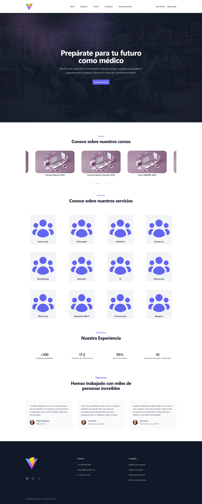
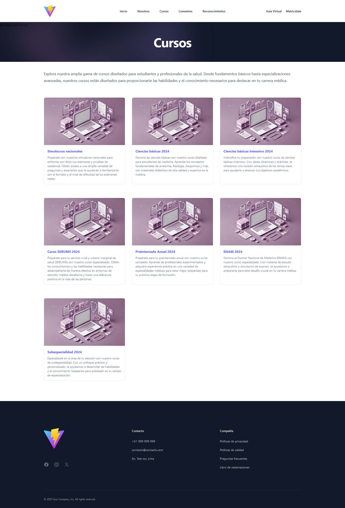
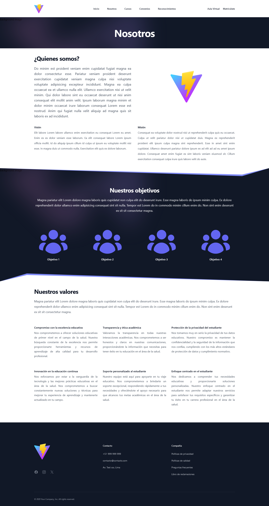
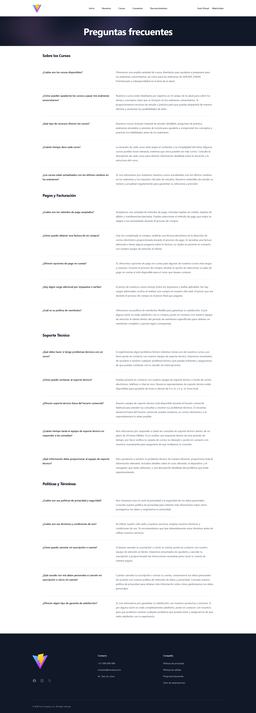

# Aula Virtual - Landing Page

Esta landing page es una presentación de nuestra **Aula Virtual**, donde los usuarios pueden explorar los cursos disponibles, conocer los convenios, y obtener información sobre los reconocimientos que pueden recibir al participar en la plataforma.

## Características Principales

- **Inicio**: Vista principal que introduce la plataforma y resalta los beneficios de utilizar nuestra Aula Virtual.
- **Nosotros**: Información sobre la misión y visión del proyecto, destacando la experiencia de los docentes y el enfoque educativo.
- **Cursos**: Muestra el catálogo de cursos disponibles, con detalles como la duración, nivel y temática de cada curso.
- **Convenios**: Información sobre los convenios con instituciones asociadas, brindando beneficios adicionales a los estudiantes.
- **Reconocimientos**: Detalles sobre los reconocimientos que los estudiantes pueden obtener al finalizar los cursos.
- **Secciones Clásicas**:
  - Políticas de privacidad
  - Políticas de calidad
  - Preguntas frecuentes
  - Libro de reclamaciones

## Vistas Principales

A continuación, algunas capturas de pantalla de las vistas clave de la landing page:

### Vista de Inicio


### Vista de Cursos


### Vista de Nosotros


### Vista de Preguntas Frecuentes


Para ver más capturas de pantalla, visita la carpeta `screenshots/` en este repositorio.

## Tecnologías Utilizadas

- **React**: Para la creación de componentes interactivos y dinámicos.
- **Vite**: Herramienta de desarrollo para un entorno rápido y optimizado.
- **Tailwind CSS**: Para una estilización rápida y eficiente, asegurando un diseño moderno y responsivo.

## Instalación

Sigue estos pasos para ejecutar la landing page localmente:

1. Clona este repositorio:

```bash
git clone https://github.com/Polarsh/aula-virtual-landing.git
```

2. Navega al directorio del proyecto:

```bash
cd aula-virtual-landing
```

3. Instala las dependencias:

```bash
npm install
```

4. Inicia el servidor de desarrollo:

```bash
npm run dev
```

5. Abre `http://localhost:5173` en tu navegador para ver la landing page.
